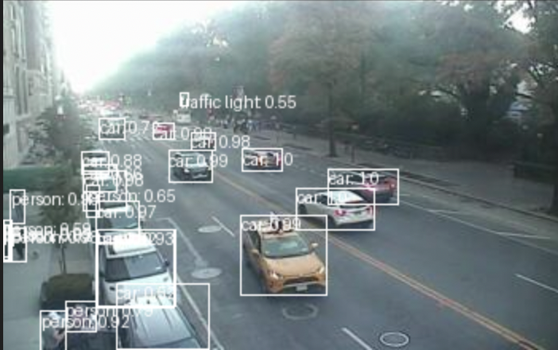

# NYC AI Traffic Camera Analysis
Leveraging object recognition models to analyze traffic patterns from NYC's free traffic camera API.

[Try out the notebook here](NYCAITrafficAnalysis.ipynb)

## Introduction
AI-driven image recognition models, combined with traffic camera data, offer a powerful framework for analyzing urban traffic patterns. This project explores how traffic camera data can be processed to gain insights into vehicle and pedestrian behavior, assess traffic density, and track movement across the city, ultimately enhancing urban mobility and informing traffic management strategies.

## Data Source
The analysis utilizes the publicly available NYC traffic camera API, which provides access to real-time images from approximately 1,000 traffic cameras across the city. A data scraping process enables the retrieval of images from all cameras in about 2 minutes, ensuring timely access to critical information.

## Processing Traffic Cameras
Having identified key features to extract from individual cameras, the next step involves analyzing broader traffic patterns. By continuously scraping data from all NYC traffic cameras, insights into traffic density and movement can be achieved. This parallelized approach allows for real-time monitoring of nearly 1,000 cameras within approximately 2 minutes.

## Traffic Analysis
Data can be visualized on an interactive heatmap, showcasing traffic patterns across the city. Once individual camera features are established, the analysis scales up to provide insights into peak congestion times and the distribution of vehicles and pedestrians. This large-scale data collection informs better traffic management strategies and infrastructure planning.

## Results
The analysis has produced detailed heatmaps that visualize traffic density across NYC. These heatmaps, generated by aggregating data from multiple traffic cameras using AI algorithms, align closely with known traffic patterns.

### Heatmap Correlation with Average Traffic
The heatmaps correlate well with historical traffic data, identifying high-density zones such as major intersections and commercial districts. This alignment confirms the model's accuracy in reflecting real-world conditions.

### Determining Density and Traffic Levels
Advanced image recognition techniques enable accurate assessments of traffic density and patterns. The analysis reveals peak traffic hours and frequent congestion points, offering a dynamic view of urban mobility. These insights can assist city planners and traffic managers in developing strategies to mitigate congestion.

## Conclusions
Analyzing NYC traffic cameras with the COCO Image Recognition model yields valuable insights into urban traffic dynamics. Processing around 1,000 cameras in about 2 minutes provides real-time analytics that support city planning and traffic management. 

Future developments could include interactive dashboards that visualize traffic patterns and predict congestion, enhancing decision-making processes. Additionally, object tracking capabilities could improve safety measures and inform urban planning, leading to safer and more efficient navigation in NYC.

## Footnotes
This project was inspired by [Traffic Cam Photo Booth](https://trafficcamphotobooth.com/), which features an interactive map of NYC traffic camera feeds. 

Please use this data responsibly.
